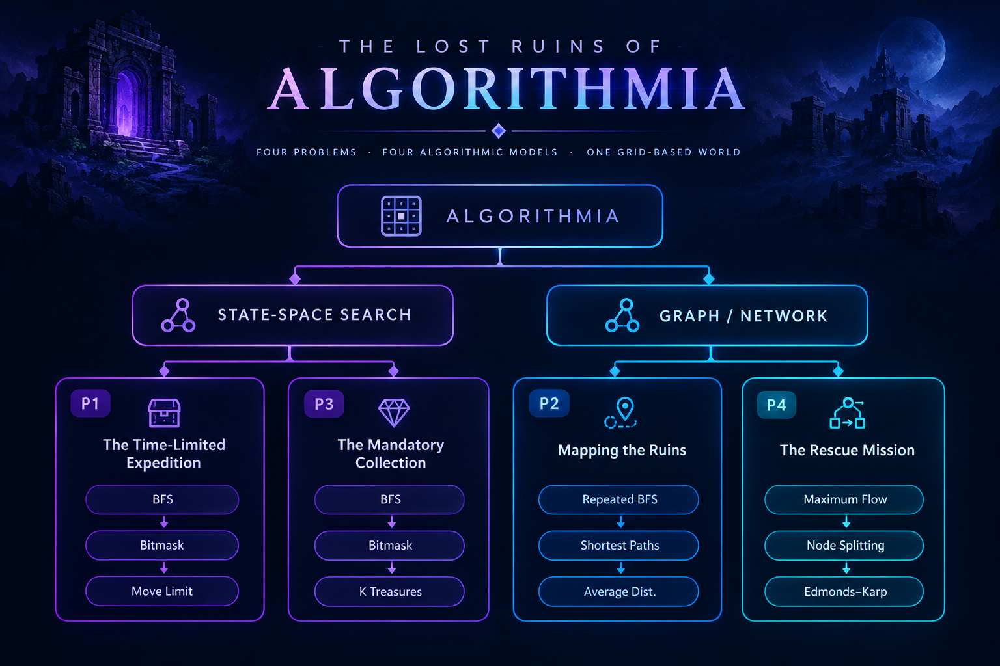

<div align="center">

# The Lost Ruins of Algorithmia

### Algorithm Design Final Project

**Iran University of Science and Technology · Python**

<br>

[](https://www.python.org/)
[](#)
[](#)
[](#)

<br>

> **Four problems. Four algorithmic models. One grid-based world.**

</div>

---

## Overview

**The Lost Ruins of Algorithmia** is an Algorithm Design final project developed at the **Iran University of Science and Technology**.

The project consists of four independent problems built around a common grid-based environment. Each problem requires a different algorithmic approach, ranging from **state-space search and bitmasking** to **shortest-path aggregation and maximum flow**.

The implementations are written in **Python**, with separate test cases and supporting documentation for each problem.

The main goal of the project was not only to implement algorithms, but to **model each problem appropriately and choose an algorithm that matches its constraints and structure**.

---

<div align="center">

## Algorithmic Map

<p align="center">
  
</p>`

</div>

---

# Problems

| Problem | Objective                                                            | Main Technique                                   |
| :-----: | -------------------------------------------------------------------- | ------------------------------------------------ |
|  **P1** | Maximize collected treasures within a move limit                     | **BFS + 4D State Space + Bitmask**               |
|  **P2** | Compute the average shortest distance between reachable cells        | **Repeated BFS**                                 |
|  **P3** | Find the shortest path while collecting at least **K** treasures     | **BFS + 3D State Space + Bitmask**               |
|  **P4** | Find the maximum number of vertex-disjoint paths from **S** to **E** | **Maximum Flow + Node Splitting + Edmonds–Karp** |

---

# P1 — The Time-Limited Expedition

### `BFS · State-Space Search · Bitmasking`

The first problem asks for the **maximum number of treasures that can be collected while reaching the destination within a given movement limit `M`**.

A standard grid position is not enough to describe the state, because two visits to the same cell can have different move counts and different sets of collected treasures.

Therefore, each BFS state is represented as:

```text
(row, col, moves_used, treasure_mask)
```

### State Components

* `row`, `col` — current position
* `moves_used` — number of moves taken
* `treasure_mask` — bitmask representing collected treasures

Each treasure receives an index:

```text
T . T . . . T
↓   ↓       ↓
T0  T1      T2
```

The mask then represents which treasures have already been collected.

For example:

```text
Treasures:  T0  T1  T2  T3  T4
Mask:       1   0   0   1   1

Binary representation:
10011
```

When a treasure is encountered, its corresponding bit is enabled using a bitwise OR operation.

### Search

BFS explores the expanded state space while respecting:

* Grid boundaries
* Walls
* Movement limit
* Treasure collection state

Whenever a state reaches the destination, the number of collected treasures is evaluated and the maximum is retained.

### Complexity

Let:

* `R` = number of rows
* `C` = number of columns
* `M` = maximum number of moves
* `T` = number of treasures

There are up to `2^T` possible treasure masks.

**Time:**

```text
O(R × C × M × 2^T)
```

**Space:**

```text
O(R × C × M × 2^T)
```

The project report also discusses a possible dynamic-programming formulation using:

```text
dp[(row, col, mask)] = minimum moves needed
```

which can reduce the dependence on `M` in the state representation.

---

# P2 — Mapping the Ruins

### `Repeated BFS · Shortest Paths`

The second problem computes the **average shortest-path distance between reachable passable cells**.

Because every movement has the same cost, BFS is sufficient to find shortest distances on the grid.

For each passable cell, a single-source BFS is executed.

The BFS maintains a distance matrix:

```text
dist[row][col]
```

where each value represents the shortest distance from the current source cell.

The process is:

```text
Passable cells
      │
      ▼
Run BFS from each cell
      │
      ▼
Collect all finite distances
      │
      ▼
Compute average distance
      │
      ▼
Truncate to 2 decimal places
```

The implementation aggregates the total distance and number of reachable cells during the BFS executions.

The final metric is:

```text
average = total_sum / total_count
```

The result is then **truncated**, rather than rounded, to two decimal places.

### Complexity

A single BFS visits the grid in:

```text
O(R × C)
```

Since BFS is executed from every passable cell, the overall complexity is:

**Time:**

```text
O((R × C)²)
```

**Space:**

```text
O(R × C)
```

---

# P3 — The Mandatory Collection

### `BFS · State-Space Search · Bitmasking`

The third problem asks for the **shortest path from `S` to `E` while collecting at least `K` treasures**.

The challenge is that position alone does not determine whether a state is valid.

Two visits to the same cell can have collected different sets of treasures.

Therefore, the BFS state is:

```text
(row, col, treasure_mask)
```

The number of moves required to reach each state is stored separately:

```text
moves[(row, col, mask)]
```

### Search Logic

The BFS proceeds through the expanded state space until it reaches a state satisfying:

```text
current position == E
AND
number of collected treasures >= K
```

Because BFS explores states level by level, the first valid state satisfying these conditions gives the minimum number of moves.

### State Transition

For every neighboring cell:

1. Check grid boundaries.
2. Reject walls.
3. Update the treasure mask if the cell contains a treasure.
4. Ignore states that have already been visited.
5. Store the new state's move count.

```text
(row, col, mask)
        │
        ▼
   adjacent cell
        │
        ├── wall? ───────► ignore
        │
        ▼
 treasure present?
        │
        ▼
 update mask
        │
        ▼
 add new state to BFS
```

### Complexity

With `T` treasures, there are up to `2^T` possible masks.

**Time:**

```text
O(R × C × 2^T)
```

**Space:**

```text
O(R × C × 2^T)
```

The report notes that `T ≤ 10`, which keeps the mask-based state space bounded for the intended problem constraints.

---

# P4 — The Rescue Mission

### `Maximum Flow · Node Splitting · Edmonds–Karp`

The fourth problem asks for the **maximum number of vertex-disjoint paths from `S` to `E`**.

Unlike the previous problems, this is modeled as a **network flow problem**.

The key difficulty is that the restriction applies to **vertices (cells)** rather than edges.

### Node Splitting

Every passable grid cell is transformed into two flow-network nodes:

```text
        capacity 1
   ┌─────────────────┐
   │                 │
node_in ──────────► node_out
```

For ordinary cells:

```text
capacity = 1
```

For `S` and `E`:

```text
capacity = ∞
```

This means an ordinary cell can belong to at most one path.

Adjacent cells are then connected through:

```text
node_out(u) → node_in(v)
```

with infinite capacity.

The resulting transformation is:

```text
Grid
 │
 ▼
Node Splitting
 │
 ▼
Flow Network
 │
 ▼
Edmonds–Karp
 │
 ▼
Maximum Flow
 │
 ▼
Maximum Vertex-Disjoint Paths
```

### Flow Network Representation

Each edge stores:

```text
(destination, remaining_capacity, reverse_edge_index)
```

The residual graph is maintained using adjacency lists.

### Edmonds–Karp

The implementation uses BFS to find augmenting paths.

For each augmenting path:

1. Find the bottleneck capacity.
2. Decrease the forward residual capacities.
3. Increase the reverse residual capacities.
4. Add the bottleneck to the total flow.

This process continues until no augmenting path from `S` to `E` remains.

At that point:

```text
maximum flow
      =
maximum number of vertex-disjoint paths
```

### Complexity

For Edmonds–Karp:

```text
O(V × E²)
```

For the transformed grid network:

```text
V = O(R × C)
E = O(R × C)
```

Therefore:

**Time:**

```text
O((R × C)³)
```

**Space:**

```text
O(R × C)
```

---

# Complexity Overview

| Problem | Algorithm                     | Time                 | Space                |
| :-----: | ----------------------------- | -------------------- | -------------------- |
|  **P1** | BFS + Bitmask                 | `O(R × C × M × 2^T)` | `O(R × C × M × 2^T)` |
|  **P2** | Repeated BFS                  | `O((R × C)²)`        | `O(R × C)`           |
|  **P3** | BFS + Bitmask                 | `O(R × C × 2^T)`     | `O(R × C × 2^T)`     |
|  **P4** | Edmonds–Karp + Node Splitting | `O((R × C)³)`        | `O(R × C)`           |

Where:

```text
R = number of rows
C = number of columns
M = movement limit
T = number of treasures
```

---

# Correctness at a Glance

Each solution is based on a model that preserves the constraints of its corresponding problem.

### P1

The BFS state contains the position, move count, and complete treasure collection state. Therefore, feasible paths can be represented and compared within the expanded state space.

### P2

All grid movements have equal cost, so BFS returns the shortest distance from a source cell to every reachable cell. Running BFS from every passable cell provides the required distance aggregation.

### P3

The BFS state contains both position and collected treasures. Since BFS explores states by increasing distance, the first state reaching `E` with at least `K` collected treasures is optimal.

### P4

Node splitting gives every ordinary cell capacity one. Consequently, each unit of flow corresponds to a path that does not share intermediate cells with another path.

---

# Project Structure

```text
The_Lost_Ruins_of_Algorithm/
│
├── docs/
│   ├── project.pdf
│   └── report.pdf
│
├── solutions/
│   ├── p1.py
│   ├── p2.py
│   ├── p3.py
│   └── p4.py
│
├── tests/
│   ├── p1_tests/
│   ├── p2_tests/
│   ├── p3_tests/
│   ├── p4_tests/
│   ├── results/
│   ├── p1_test.py
│   ├── p2_test.py
│   ├── p3_test.py
│   └── p4_test.py
│
├── .gitignore
└── README.md
```

---

# Running the Solutions

Each problem is implemented independently.

For example:

```python
from solutions.p1 import solve
```

Individual test scripts can be executed with:

```bash
python tests/p1_test.py
```

Replace `p1` with `p2`, `p3`, or `p4` to run the corresponding test suite.

---

# Documentation

Two documents are included with the project:

| Document                            | Description                                                                                |
| ----------------------------------- | ------------------------------------------------------------------------------------------ |
| [`project.pdf`](./docs/project.pdf) | Original Algorithm Design project specification                                            |
| [`report.pdf`](./docs/report.pdf)   | Implementation details, algorithmic reasoning, correctness proofs, and complexity analysis |

The report provides the detailed reasoning behind the implementations, while this README gives a concise technical overview.

---

# Technical Highlights

<div align="center">

| Concept              |      Used In      |
| :------------------- | :---------------: |
| Breadth-First Search | P1 · P2 · P3 · P4 |
| State-Space Modeling |      P1 · P3      |
| Bitmasking           |      P1 · P3      |
| Shortest-Path Search |      P2 · P3      |
| Repeated BFS         |         P2        |
| Node Splitting       |         P4        |
| Maximum Flow         |         P4        |
| Edmonds–Karp         |         P4        |
| Residual Graphs      |         P4        |

</div>

---

# Author

<div align="center">

### Ehsan Moeini

**Computer Science Student**
Iran University of Science and Technology

<br>

[](https://github.com/EHMoeini)

</div>

---

<div align="center">

<sub>Algorithm Design · Graph Search · State Spaces · Network Flow</sub>

<br><br>

<sub>Built as part of the Computer Science curriculum at IUST.</sub>

</div>
